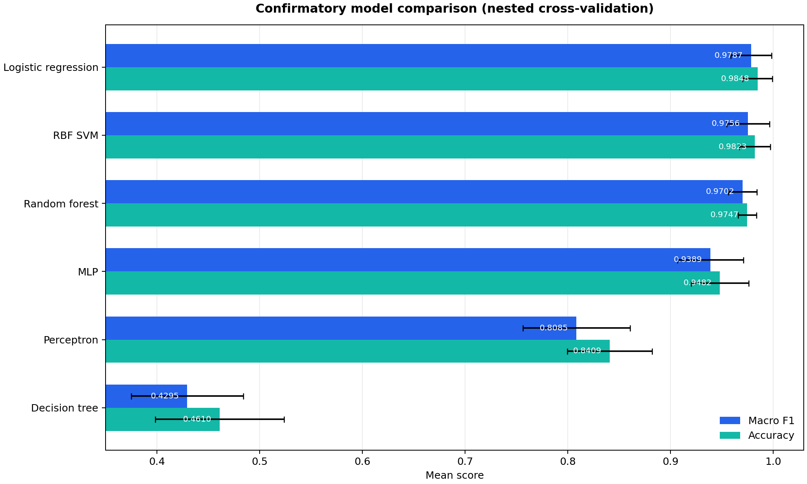

# Leaf Classification — Multiclass ML Benchmark

An end-to-end comparison of six supervised-learning models on the Kaggle Leaf
Classification dataset. This repository is the personal portfolio edition of an
IFT712 *Techniques d'apprentissage* project, curated and authored by
[Mouloud Serir](https://github.com/Mouloud08).

The project combines a reusable Python experiment pipeline with eight fully
executed notebooks and bilingual reports. It emphasizes reproducible model
selection: tuning is evaluated with nested cross-validation, and exploratory
results are kept separate from confirmatory estimates.

## Result at a glance

| Dataset | Benchmark | Best confirmatory result |
| --- | --- | --- |
| 990 labelled leaves · 99 species · 192 numeric features | Perceptron, logistic regression, SVM, random forest, decision tree, MLP | Tuned logistic regression: **macro-F1 0.9787 ± 0.0198**, **accuracy 0.9848** |

The reported values are means across the outer folds of nested cross-validation;
the uncertainty shown for macro-F1 is one standard deviation. See the
[global comparison notebook](notebooks/08_Comparaison_Globale.ipynb) for the
model-by-model evidence and diagnostics.



## Start here

- [English portfolio report](report/pdf/leaf-classification-portfolio-en.pdf)
- [Rapport portfolio en français](report/pdf/leaf-classification-portfolio-fr.pdf)
- [Global model comparison notebook](notebooks/08_Comparaison_Globale.ipynb)
- [Dataset provenance and integrity](data/README.md)

> These reports are revised portfolio editions, not the archived April 2026
> course submission.

## What the project covers

The dataset represents each specimen with 64 margin, 64 shape, and 64 texture
descriptors. The study compares six model families under a shared evaluation
framework:

1. Perceptron
2. Logistic regression
3. Support vector machine (SVM)
4. Random forest
5. Decision tree
6. Multilayer perceptron (MLP)

The workflow includes deterministic data preparation, baseline and improved
variants, hyperparameter tuning, nested cross-validation, out-of-fold
predictions, multiclass diagnostics, learning curves, confusion analysis, and a
final cross-model comparison. The default random seed is `42`.

## Repository architecture

```text
.
├── assets/       # Portfolio visuals used by this README
├── data/         # Included Kaggle training CSV and provenance notes
├── notebooks/    # EDA, six model studies, and the global comparison
├── report/       # Bilingual LaTeX sources, build script, and final PDFs
├── src/          # Data, models, evaluation, experiments, plots, and CLI
└── tests/        # Unit, integration, methodology, and artifact checks
```

Generated experiment artifacts are written to `results/` and intentionally
ignored by Git. The notebooks retain their checked outputs so the analysis can
be reviewed directly on GitHub without rerunning the full benchmark.

## Reproduce the project

### 1. Install

Python 3.10 or newer is required. From the repository root:

```powershell
python -m venv .venv
.\.venv\Scripts\Activate.ps1
python -m pip install --upgrade pip
python -m pip install -e ".[dev]"
```

For the exact dependency set used by CI, install the hash-locked environment:

```powershell
python -m pip install --require-hashes -r requirements-lock.txt
python -m pip install --no-build-isolation --no-deps -e .
```

On macOS or Linux, activate the environment with
`source .venv/bin/activate` instead.

The checked training data is already available at `data/raw/train.csv`. Its
shape and SHA-256 fingerprint are documented in [data/README.md](data/README.md).

### 2. Use the command-line pipeline

```powershell
leaf-classification --help
leaf-classification --all
```

The module form is equivalent and works without the installed console wrapper:

```powershell
python -m src --models regression_logistique svm mlp
```

Useful options include `--skip-existing`, `--force`, `--no-tuning`,
`--no-figures`, and `--output-root`. Running every nested-CV study is
compute-intensive; start with one model when validating a new environment.

### 3. Review or rerun the notebooks

```powershell
jupyter notebook notebooks/08_Comparaison_Globale.ipynb
```

Notebook `01` introduces the data, notebooks `02`–`07` study one model each,
and notebook `08` consolidates the comparison and conclusions.

### 4. Run quality checks

```powershell
python -m ruff check src tests report/build.py report/generate_localized_figures.py
python -m ruff format --check src tests report/build.py report/generate_localized_figures.py
python -m pytest -q
```

### 5. Build the bilingual reports

A local LaTeX distribution with `latexmk` is required.

```powershell
python report/build.py --language all
python report/build.py --language all --check
```

Use `--language en` or `--language fr` to build one edition, and `--clean` to
remove local report build products.

## Data source

The included `train.csv` comes from Kaggle's
[Leaf Classification competition](https://www.kaggle.com/competitions/leaf-classification/data).
Kaggle's [competition rules](https://www.kaggle.com/competitions/leaf-classification/rules)
govern use of the competition data. The dataset is third-party material and is
not covered by the project's copyright notice.

## Author and rights

**Mouloud Serir** · [GitHub @Mouloud08](https://github.com/Mouloud08)

This curated repository and both portfolio reports are presented as Mouloud
Serir's personal portfolio work. Project materials are all rights reserved; see
[NOTICE.md](NOTICE.md). Third-party dataset rights remain with their respective
owners.
